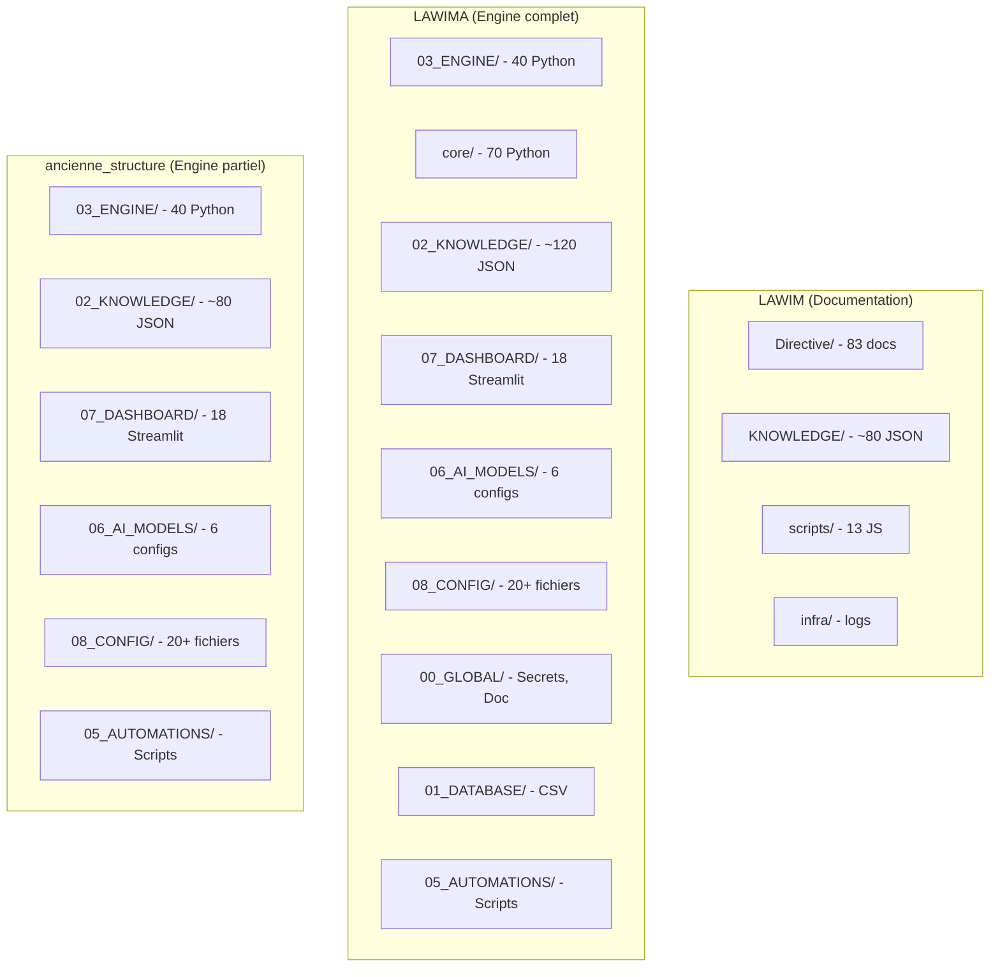

# AUDIT D'HÉRITAGE PHASE 2 — QUALIFICATION ET PLAN DE MIGRATION VERS LAWIM_V2

**Date :** 15 juillet 2026
**Mission :** Phase 2 – Qualification et Plan de Migration
**Branches auditées :** `LAWIM`, `LAWIMA`, `ancienne_structure`
**Référentiel cible :** `LAWIM_V2` (branche `main` actuelle)

---

## Table des matières

1. [Résumé exécutif](#1-résumé-exécutif)
2. [Périmètre et méthodologie](#2-périmètre-et-méthodologie)
3. [Analyse comparative des trois branches](#3-analyse-comparative-des-trois-branches)
4. [Audit complet par domaine](#4-audit-complet-par-domaine)
5. [Tableau des doublons](#5-tableau-des-doublons)
6. [Tableau des composants obsolètes](#6-tableau-des-composants-obsolètes)
7. [Tableau des composants à fusionner](#7-tableau-des-composants-à-fusionner)
8. [Cartographie finale LAWIM_V2](#8-cartographie-finale-lawim_v2)
9. [Backlog de migration](#9-backlog-de-migration)
10. [Risques et recommandations](#10-risques-et-recommandations)

---

## 1. Résumé exécutif

### 1.1 État des lieux

| Branche | Contenu principal | Volume | Qualité | Statut |
|---------|-------------------|--------|---------|--------|
| **LAWIM** | Documentation (100+ MD), Knowledge JSON (~80), Scripts JS (~10), Configs | ~290 entrées | Documentation excellente, pas de code backend | Documentation/knowledge backup |
| **LAWIMA** | Engine Python (~60), Dashboards Streamlit (~18), Knowledge JSON (~120), Configs, core/ monolith (~70) | ~400+ entrées | Code fonctionnel mais obsolète, credentials hardcodés, pas de tests unitaires | Backup le + complet des 3 branches legacy |
| **ancienne_structure** | Engine Python (~40), Dashboards Streamlit (~18), Knowledge JSON (~80), Configs | ~300 entrées | Sous-ensemble de LAWIMA (sans core/, sans 02_KNOWLEDGE/) | Backup partiel LAWIMA |
| **LAWIM_V2 (cible)** | Backend Python 76K LOC (276 fichiers), Frontend React 19K LOC (162 fichiers), Tests 25K LOC (85 fichiers), Knowledge unifié (50 fichiers), Documentation canonique (24 docs) | ~600+ entrées | Production-grade, DDD, repository pattern, 2631 tests, Prisma ORM | **Rc/Beta — cible de migration** |

### 1.2 Constats clés

1. **LAWIMA et ancienne_structure sont quasi identiques** pour le dossier `03_ENGINE/` (différence nulle hormis `__pycache__`). LAWIMA contient des dossiers supplémentaires (`core/`, `02_KNOWLEDGE/`, `99_ARCHIVES/`, `tools/`).
2. **LAWIM est un backup de documentation et de connaissance** — aucune application exécutable.
3. **LAWIM_V2 a déjà réimplémenté ~90% des fonctionnalités** des branches legacy mais dans une architecture totalement différente (Python DDD vs Python monolithique, React vs Streamlit, Prisma vs CSV).
4. **Le knowledge base legacy** (LAWIM/LAWIMA) contient ~80-120 fichiers JSON qui doivent être analysés pour enrichir `knowledge_unified/`.
5. **Les credentials et secrets sont en clair** dans toutes les branches legacy — risque de sécurité.

### 1.3 Décisions globales

| Décision | Périmètre | Justification |
|----------|-----------|---------------|
| **Conserver tel quel** | LAWIM_V2 (`main`) | Architecture cible déjà en place, production-grade |
| **Adapter** | knowledge_unified/ | Enrichir avec données legacy manquantes |
| **Refactoriser** | Aucun composant legacy | Architecture incompatible (monolithique → DDD) |
| **Réécrire** | ~~Tout le legacy engine~~ | Déjà fait dans LAWIM_V2 |
| **Supprimer** | Tous les composants legacy redondants | LAWIM_V2 est l'implémentation de référence |
| **Fusionner** | Knowledge JSON legacy → knowledge_unified/ | Consolider les données camerounaises |

---

## 2. Périmètre et méthodologie

### 2.1 Branches analysées

```
/media/abel/Doc/Drive/d/LAWIM_BACKUP_20260608_125026/
├── LAWIM/              # Documentation + Knowledge JSON
├── LAWIMA/             # Engine complet + core/ monolith + Knowledge
└── ancienne_structure/ # Engine (sous-ensemble de LAWIMA)
```

### 2.2 Référentiel cible

```
/media/abel/5688bf41-1616-43e6-95c7-b9f1f043c850/LAWIM_V2/
├── code/lawim_v2/      # Backend Python (DDD)
├── frontend/           # React/TypeScript
├── knowledge_unified/  # Knowledge consolidé
├── prisma/             # Schéma DB + migrations
├── tests/              # 2631 tests
├── docs/               # ADR + Canonique
├── deployment/         # Déploiement production-grade
└── ...
```

### 2.3 Critères d'évaluation

| Critère | Définition |
|---------|------------|
| **Maturité** | Échelle : Stub < Ébauché < Fonctionnel < Complet < Production |
| **Qualité** | Tests présents, typage, documentation, architecture, sécurité |
| **Périmètre fonctionnel** | Couverture des besoins métier LAWIM |
| **Maintenabilité** | Architecture, dette technique, duplication |
| **Cohérence** | Alignement avec l'architecture cible LAWIM_V2 |

---

## 3. Analyse comparative des trois branches

### 3.1 Matrice de présence des composants par branche



### 3.2 Correspondance LAWIM_V2 ↔ Legacy

| Domaine | LAWIM | LAWIMA | ancienne_structure | LAWIM_V2 |
|---------|-------|--------|-------------------|----------|
| **Backend** | Aucun | 40+ Python (monolithique) | 40 Python (monolithique) | **276 Python (DDD)** |
| **Frontend/Dashboard** | Aucun | 18 Streamlit | 18 Streamlit | **162 React/TS** |
| **Knowledge** | ~80 JSON | ~120 JSON | ~80 JSON | **50 fichiers unifiés** |
| **Documentation** | 100+ MD | 10 MD + docx | 10 MD + docx | **24 canoniques + 9 ADR** |
| **DB Schema** | Aucun | CSV + Supabase | CSV + Supabase | **Prisma (12 modèles)** |
| **API** | Aucun | Flask hardcodé | Flask hardcodé | **REST server (4038 LOC)** |
| **Tests** | Aucun | 1 fichier (100 tests) | 1 fichier (100 tests) | **85 fichiers (2631 tests)** |
| **Déploiement** | Aucun | Docker simple | Docker simple | **Docker compose multi-env + systemd** |

---

## 4. Audit complet par domaine

### 4.1 Architecture

| Composant | Branche | Chemin | Description | Maturité | Décision | Justification |
|-----------|---------|--------|-------------|----------|----------|---------------|
| Architecture canonique | LAWIM_V2 | `docs/canonical/` | 24 documents couvrant vision, domaines, specs, gouvernance | Production | **Conserver** | Référence architecturale officielle |
| ADR | LAWIM_V2 | `docs/adr/` | 9 décisions architecturales | Complet | **Conserver** | Trace des décisions clés |
| Constitution LAWIM | LAWIM | `Directive/00-CONSTITUTION.md` | Principes fondamentaux du projet | Complet | **Supprimer** | Contenu déjà intégré dans les docs canoniques LAWIM_V2 |
| Architecture legacy | LAWIMA | `00_GLOBAL/doc_reference/ARCHITECTURE.md` | Overview technique 19 lignes | Ébauché | **Supprimer** | Remplacé par docs canoniques |
| Plan d'implémentation legacy | LAWIM | `Directive/31-IMPLEMENTATION-ROADMAP.md` | Roadmap complète | Complet | **Conserver comme référence** | Peut servir d'historique pour la traçabilité |

### 4.2 Core

| Composant | Branche | Chemin | Description | Maturité | Décision | Justification |
|-----------|---------|--------|-------------|----------|----------|---------------|
| Serveur HTTP | LAWIM_V2 | `code/lawim_v2/server.py` | 4038 LOC, routing, request lifecycle | Production | **Conserver** | Cœur du backend |
| DB abstraite | LAWIM_V2 | `code/lawim_v2/db.py` | 1966 LOC, connection pooling | Production | **Conserver** | Fondation persistance |
| Persistance | LAWIM_V2 | `code/lawim_v2/persistence.py` | 1398 LOC, schema manifest | Production | **Conserver** | Gestion schéma |
| Services | LAWIM_V2 | `code/lawim_v2/services.py` | 1161 LOC, orchestration | Production | **Conserver** | Injection dépendances |
| Config | LAWIM_V2 | `code/lawim_v2/config.py` | 638 LOC, AppConfig | Production | **Conserver** | Configuration applicative |
| Prisma schema | LAWIM_V2 | `prisma/schema.prisma` | 12 modèles, v19 | Production | **Conserver** | Schéma DB officiel |
| lawim_engine_v1.py | LAWIMA/ancienne | `03_ENGINE/lawim_engine_v1.py` | Moteur principal chaîné legacy | Fonctionnel | **Supprimer** | Remplacé par LAWIM_V2 services.py |
| pipeline_supabase.py | LAWIMA/ancienne | `03_ENGINE/pipeline_supabase.py` | Pipeline CSV/Supabase | Fonctionnel | **Supprimer** | Remplacé par persistence DDD |
| Gateway WhatsApp | LAWIMA/ancienne | `03_ENGINE/whatsapp_gateway_v2.py` | Flask webhook | Fonctionnel | **Supprimer** | Remplacé par communication/ |
| gateway_universal.py | LAWIMA | `core/gateway_universal.py` | Gateway monolithique | Fonctionnel | **Supprimer** | Remplacé par communication/ |
| service_manager.py | LAWIMA/ancienne | `03_ENGINE/service_manager.py` | Gestion services (stub) | Stub | **Supprimer** | Stub vide |

### 4.3 Services

| Composant | Branche | Chemin | Description | Maturité | Décision | Justification |
|-----------|---------|--------|-------------|----------|----------|---------------|
| Services métier | LAWIM_V2 | `code/lawim_v2/services.py` | Orchestrateur de domaines | Production | **Conserver** | Architecture cible |
| DTOs | LAWIM_V2 | `code/lawim_v2/dto.py` | Data transfer objects | Production | **Conserver** | Contrats d'API |
| Errors | LAWIM_V2 | `code/lawim_v2/errors.py` | Définitions d'erreurs | Production | **Conserver** | Gestion erreurs |
| Actions engine | LAWIMA/ancienne | `08_CONFIG/action_engine/actions_v1.py` | Actions CRUD legacy | Fonctionnel | **Supprimer** | Remplacé par DDD |
| Rule engine V2-V5 | LAWIMA/ancienne | `08_CONFIG/rule_engine/` | 5 versions de règles JSON | Fonctionnel | **Conserver comme référence** | Logique métier à extraire |

### 4.4 Modules

| Composant | Branche | Chemin | Description | Maturité | Décision | Justification |
|-----------|---------|--------|-------------|----------|----------|---------------|
| Conversation v2 | LAWIM_V2 | `code/lawim_v2/conversation/` | 10 sous-modules, DDD complet | Production | **Conserver** | Moteur conversation officiel |
| CRM | LAWIM_V2 | `code/lawim_v2/crm/` | 7 fichiers, schema v14 | Production | **Conserver** | CRM cible |
| Communication | LAWIM_V2 | `code/lawim_v2/communication/` | 22 fichiers, schema v17 | Production | **Conserver** | Omnicanal cible |
| Marketplace | LAWIM_V2 | `code/lawim_v2/marketplace/` | 7 fichiers, schema v15 | Production | **Conserver** | Marketplace cible |
| Financial | LAWIM_V2 | `code/lawim_v2/financial/` | 10 fichiers, CamPay | Production | **Conserver** | Paiements cible |
| Security | LAWIM_V2 | `code/lawim_v2/security/` | 20 fichiers, schema v16 | Production | **Conserver** | Sécurité cible |
| Analytics | LAWIM_V2 | `code/lawim_v2/analytics/` | 18 fichiers, schema v18 | Production | **Conserver** | Analytics cible |
| Backup | LAWIM_V2 | `code/lawim_v2/backup/` | 9 fichiers, orchestration | Production | **Conserver** | Backup cible |
| Workflow automation | LAWIM_V2 | `code/lawim_v2/workflow_automation/` | 7 fichiers, schema v12 | Production | **Conserver** | Workflow cible |
| Cognition | LAWIM_V2 | `code/lawim_v2/cognition/` | 7 fichiers, schema v9 | Production | **Conserver** | Cognition cible |
| Knowledge platform | LAWIM_V2 | `code/lawim_v2/knowledge_platform/` | 8 fichiers, schema v11 | Production | **Conserver** | Knowledge cible |
| Intelligence | LAWIM_V2 | `code/lawim_v2/intelligent/` | 7 fichiers, schema v7 | Production | **Conserver** | Intelligence cible |
| Real estate intelligence | LAWIM_V2 | `code/lawim_v2/real_estate_intelligence/` | 7 fichiers, schema v13 | Production | **Conserver** | Intelligence immobilière cible |
| Source intelligence | LAWIM_V2 | `code/lawim_v2/source_intelligence/` | 7 fichiers | Production | **Conserver** | Veille cible |
| Ecosystem | LAWIM_V2 | `code/lawim_v2/ecosystem/` | 7 fichiers, schema v8 | Production | **Conserver** | Écosystème cible |

### 4.5 API

| Composant | Branche | Chemin | Description | Maturité | Décision | Justification |
|-----------|---------|--------|-------------|----------|----------|---------------|
| REST API server | LAWIM_V2 | `code/lawim_v2/server.py` | 4038 LOC, routing complet | Production | **Conserver** | API cible |
| API query | LAWIM_V2 | `code/lawim_v2/api_query.py` | Parseur de requêtes API | Production | **Conserver** | Query API |
| API reference legacy | LAWIM | `Directive/16-API-REFERENCE.md` | Catalogue d'endpoints legacy | Complet | **Conserver comme référence** | À comparer avec l'API actuelle |
| API SDK frontend | LAWIM_V2 | `frontend/packages/api-sdk/` | Client SDK TypeScript | Stub | **Adapter** | Compléter l'implémentation |

### 4.6 Infrastructure

| Composant | Branche | Chemin | Description | Maturité | Décision | Justification |
|-----------|---------|--------|-------------|----------|----------|---------------|
| Docker compose | LAWIM_V2 | `compose/` | 5 overlays (base, dev, staging, prod, postgres) | Production | **Conserver** | Infrastructure cible |
| Déploiement | LAWIM_V2 | `deployment/` | 73 fichiers, runbooks, systemd, backup, nginx | Production | **Conserver** | Déploiement cible |
| Infra OVH | LAWIM_V2 | `OPS/OVH/` | 22 documents ops OVH | Complet | **Conserver** | Ops cloud |
| Dockerfile legacy | LAWIMA/ancienne | `Dockerfile` | Python 3.12-slim, Flask | Fonctionnel | **Supprimer** | Remplacé par déploiement LAWIM_V2 |
| Docker compose legacy | LAWIMA/ancienne | `docker-compose.yml` | Service unique lawim-gateway | Fonctionnel | **Supprimer** | Remplacé par compose/ multi-service |
| Infra legacy | LAWIM | `infra/logs/nginx/` | Logs nginx vides | Stub | **Supprimer** | Aucune valeur |

### 4.7 Runtime

| Composant | Branche | Chemin | Description | Maturité | Décision | Justification |
|-----------|---------|--------|-------------|----------|----------|---------------|
| Runtime orchestrateur | LAWIM_V2 | `.lawim/` | AIOS orchestrateur, tickets, policies | Production | **Conserver** | Runtime cible |
| Santé/monitoring | LAWIM_V2 | `deployment/health/` | Health checker | Production | **Conserver** | Monitoring cible |
| Runtime legacy | LAWIMA/ancienne | `09_RUNTIME/` | Logs et output runtime | Stub | **Supprimer** | Données runtime obsolètes |

### 4.8 IA

| Composant | Branche | Chemin | Description | Maturité | Décision | Justification |
|-----------|---------|--------|-------------|----------|----------|---------------|
| AI orchestrateur | LAWIM_V2 | `code/lawim_v2/ai/` | 10+ fichiers, providers LLM | Production | **Conserver** | IA cible |
| AI governance | LAWIM_V2 | `docs/canonical/15_AI_GOVERNANCE.md` | Gouvernance IA | Production | **Conserver** | Gouvernance cible |
| AI providers | LAWIM_V2 | `code/lawim_v2/ai/providers/` | DeepSeek, Gemini, OpenAI | Production | **Conserver** | Multi-provider cible |
| Prompt library | LAWIM_V2 | `prompts/` | Prompts LLM systèmes | Production | **Conserver** | Prompts cible |
| Knowledge packs | LAWIM_V2 | `knowledge_packs/` | Packs de connaissance IA | Complet | **Conserver** | Context injection |
| DeepSeek integration | LAWIMA/ancienne | `03_ENGINE/deepseek_integration.py` | 158 LOC, intégration DeepSeek legacy | Fonctionnel | **Supprimer** | Remplacé par ai/providers/deepseek.py |
| Réponse router | LAWIMA/ancienne | `03_ENGINE/response_router.py` | Routage hiérarchique réponses | Fonctionnel | **Supprimer** | Remplacé par conversation/generation/ |
| System prompt legacy | LAWIMA/ancienne | `03_ENGINE/deepseek_prompt.txt` | Prompt template legacy | Ébauché | **Conserver comme référence** | Contenu à extraire pour prompts/ |
| AI models config legacy | LAWIMA/ancienne | `06_AI_MODELS/` | 6 configs JSON (v1) | Ébauché | **Conserver comme référence** | Logique à analyser |
| System prompt v1 | LAWIMA/ancienne | `06_AI_MODELS/prompts/system_prompt_v1.md` | Prompt maître IA legacy (73 lignes) | Fonctionnel | **Conserver comme référence** | Style et comportement à analyser |

### 4.9 Planner

| Composant | Branche | Chemin | Description | Maturité | Décision | Justification |
|-----------|---------|--------|-------------|----------|----------|---------------|
| Conversation planner | LAWIM_V2 | `code/lawim_v2/conversation/planning/` | 7 fichiers (planner, anti_loop, next_action) | Production | **Conserver** | Planner cible |
| Dossier selector | LAWIM_V2 | `code/lawim_v2/conversation/planning/dossier_selector.py` | Sélection de dossier conversation | Production | **Conserver** | Planner cible |
| Transition policy | LAWIM_V2 | `code/lawim_v2/conversation/planning/transition_policy.py` | Politique de transition | Production | **Conserver** | Planner cible |

### 4.10 Memory

| Composant | Branche | Chemin | Description | Maturité | Décision | Justification |
|-----------|---------|--------|-------------|----------|----------|---------------|
| Conversation memory | LAWIM_V2 | `code/lawim_v2/conversation/memory/` | 3 fichiers (repository, service) | Production | **Conserver** | Memory cible |
| Conversation memory legacy | LAWIMA/ancienne | `03_ENGINE/conversation_memory.py` | 211 LOC, phrases bienvenue, historique | Fonctionnel | **Supprimer** | Remplacé par conversation/memory/ |
| Long term memory legacy | LAWIMA/ancienne | `03_ENGINE/long_term_memory.py` | Mémoire long-terme legacy | Fonctionnel | **Supprimer** | Remplacé |
| Memory manager legacy | LAWIMA/ancienne | `03_ENGINE/memory_manager/memory_manager.py` | Stub vide | Stub | **Supprimer** | Fichier vide |
| Memory rules legacy | LAWIMA/ancienne | `06_AI_MODELS/memory/memory_rules_v1.json` | Règles mémoire (oublier après 90j) | Ébauché | **Conserver comme référence** | Logique de rétention à analyser |

### 4.11 Context

| Composant | Branche | Chemin | Description | Maturité | Décision | Justification |
|-----------|---------|--------|-------------|----------|----------|---------------|
| Contexte conversation | LAWIM_V2 | `code/lawim_v2/conversation/domain/` | 13 fichiers domaine | Production | **Conserver** | Contexte cible |
| Knowledge context | LAWIM_V2 | `knowledge_unified/` | 50 fichiers, contexte métier | Production | **Conserver** | Contexte knowledge cible |

### 4.12 Policy

| Composant | Branche | Chemin | Description | Maturité | Décision | Justification |
|-----------|---------|--------|-------------|----------|----------|---------------|
| Feature flags | LAWIM_V2 | Intégré dans `config.py` | Gestion feature flags | Production | **Conserver** | Feature flags cible |
| ADR Feature flags | LAWIM_V2 | `docs/adr/ADR-008-Feature-Flag-Governance.md` | Gouvernance feature flags | Production | **Conserver** | ADR cible |
| Response policy legacy | LAWIMA/ancienne | `00_GLOBAL/rules/RESPONSE_POLICY.md` | Politique de réponse client | Complet | **Conserver comme référence** | Contenu à extraire |
| Response policy | LAWIM_V2 | `code/lawim_v2/conversation/generation/response_policy.py` | Politique de réponse DDD | Production | **Conserver** | Politique cible |
| Feature flags legacy | LAWIMA/ancienne | `08_CONFIG/features/FEATURE_FLAGS.json` | Feature flags legacy | Fonctionnel | **Conserver comme référence** | État des fonctionnalités au moment du backup |

### 4.13 Qualification

| Composant | Branche | Chemin | Description | Maturité | Décision | Justification |
|-----------|---------|--------|-------------|----------|----------|---------------|
| Qualification engine | LAWIM_V2 | `code/lawim_v2/conversation/qualification/` | 6 fichiers (evaluator, matrices, priority, readiness, registry) | Production | **Conserver** | Qualification cible |
| Qualification knowledge | LAWIM_V2 | `knowledge_unified/qualification/` | 8 fichiers (intentions, matrices) | Production | **Conserver** | Knowledge qualification cible |
| Qualification matrix legacy | LAWIM | `Directive/18_QUALIFICATION_MATRIX_IMPLEMENTATION.md` | Matrice qualification détaillée | Complet | **Fusionner** | Contenu à intégrer dans knowledge_unified/qualification/ |
| Qualification questions | LAWIM | `KNOWLEDGE/conversation-qualification-questions.md` | Catalogue questions qualification | Complet | **Fusionner** | À intégrer dans qualification/ |
| Qualification reference | LAWIM | `KNOWLEDGE/property-qualification-reference.md` | Référence qualification propriété | Complet | **Fusionner** | À intégrer |

### 4.14 Intent Detection

| Composant | Branche | Chemin | Description | Maturité | Décision | Justification |
|-----------|---------|--------|-------------|----------|----------|---------------|
| Intent detector v2 | LAWIM_V2 | `code/lawim_v2/conversation/understanding/` | Extraction d'intent (extractor, ambiguity, short_replies) | Production | **Conserver** | Intent detection cible |
| Intent detector legacy | LAWIMA/ancienne | `03_ENGINE/intent_detector/intent_detector.py` | 68 LOC, keyword-based | Fonctionnel | **Supprimer** | Remplacé par LLM + extractor |
| Intent knowledge legacy | LAWIMA/ancienne | `02_KNOWLEDGE/intents/` | 5 fichiers JSON d'intents | Ébauché | **Fusionner** | Patterns à intégrer dans knowledge_unified/language/ |
| Lead classifier model | LAWIMA/ancienne | `06_AI_MODELS/lead_classifier/lead_classifier_v1.json` | Config classification leads | Ébauché | **Conserver comme référence** | Règles de scoring à analyser |

### 4.15 Conversation

| Composant | Branche | Chemin | Description | Maturité | Décision | Justification |
|-----------|---------|--------|-------------|----------|----------|---------------|
| Conversation v2 | LAWIM_V2 | `code/lawim_v2/conversation/` | Engine conversation complet | Production | **Conserver** | Conversation cible |
| Domain models | LAWIM_V2 | `code/lawim_v2/conversation/domain/` | 13 modèles (actions, states, events, consent, etc.) | Production | **Conserver** | Modèles cible |
| Message generation | LAWIM_V2 | `code/lawim_v2/conversation/generation/` | 5 fichiers (composer, llm_adapter, templates) | Production | **Conserver** | Génération cible |
| Conversation patterns legacy | LAWIM | `KNOWLEDGE/conversation-patterns.md` | Patterns de conversation reconnus | Complet | **Conserver comme référence** | Inspirations pour les tests |
| Conversation flows | LAWIMA/ancienne | `06_AI_MODELS/conversation_flows/conversation_flows_v1.json` | Flows par intent legacy | Ébauché | **Conserver comme référence** | Structure de dialogue à analyser |
| Multilingual responses | LAWIMA/ancienne | `03_ENGINE/multilingual_responses.py` | Templates FR/EN/Pidgin | Fonctionnel | **Supprimer** | Remplacé par generation/templates.py |
| Language handler | LAWIMA/ancienne | `03_ENGINE/language_handler.py` | Système bilingue FR/EN | Fonctionnel | **Supprimer** | Remplacé par i18n |
| Language detector | LAWIMA/ancienne | `03_ENGINE/language_detector.py` | Détection FR/EN par keywords | Fonctionnel | **Supprimer** | Remplacé |
| Orchestrator | LAWIMA/ancienne | `03_ENGINE/orchestrator/orchestrator.py` | 57 LOC, chaînage intent→scoring | Fonctionnel | **Supprimer** | Remplacé par conversation/service.py |

### 4.16 Matching

| Composant | Branche | Chemin | Description | Maturité | Décision | Justification |
|-----------|---------|--------|-------------|----------|----------|---------------|
| Matching engine v2 | LAWIM_V2 | `code/lawim_v2/conversation/matching/` | 6 fichiers (criteria, ranking, scoring, results) | Production | **Conserver** | Matching cible |
| Search engine | LAWIM_V2 | `code/lawim_v2/conversation/search/` | 5 fichiers (adapters, filters, query, results) | Production | **Conserver** | Search cible |
| Matching knowledge | LAWIM_V2 | `knowledge_unified/matching/` | 6 fichiers (exclusion, weights, ranking, scoring) | Production | **Conserver** | Knowledge matching cible |
| Property matcher legacy | LAWIMA/ancienne | `03_ENGINE/property_matcher/` | 3 versions (v4 supabase, v5 scoring) | Fonctionnel | **Supprimer** | Remplacé par matching/ |
| Matching engine ref legacy | LAWIM | 7 documents matching engine | Plans, architecture, gaps, v1 summary | Complet | **Conserver comme référence** | Logique métier à analyser |
| Property matching model | LAWIMA/ancienne | `06_AI_MODELS/matching_engine/property_matching_v1.json` | Weights, budget tolerances | Ébauché | **Fusionner** | Poids et règles à intégrer |
| Matching reference legacy | LAWIM | `Directive/04-MATCHING-REFERENCE.md` | Référence matching engine | Complet | **Fusionner** | Contenu à extraire |

### 4.17 Lead Scoring

| Composant | Branche | Chemin | Description | Maturité | Décision | Justification |
|-----------|---------|--------|-------------|----------|----------|---------------|
| Lead scoring legacy | LAWIMA/ancienne | `03_ENGINE/lead_scorer/` | 2 versions (v1 CSV, v2 Supabase) | Fonctionnel | **Supprimer** | Remplacé par qualification/ |
| Lead scoring rules legacy | LAWIM | `KNOWLEDGE/lead_scoring/lead_scoring.json` | Règles et poids de scoring | Complet | **Fusionner** | À intégrer dans qualification/ |
| Lead scoring rules (scoring/) | LAWIMA | `02_KNOWLEDGE/scoring/lead_scoring_rules.json` | Règles détaillées scoring | Complet | **Fusionner** | À intégrer |
| Request engine docs | LAWIM | 3 documents REQUEST_ENGINE | Plan, décisions, validation | Complet | **Conserver comme référence** | Logique à analyser |

### 4.18 Knowledge

| Composant | Branche | Chemin | Description | Maturité | Décision | Justification |
|-----------|---------|--------|-------------|----------|----------|---------------|
| Knowledge unified | LAWIM_V2 | `knowledge_unified/` | 50 fichiers, 12 sous-domaines | ~80% complet | **Conserver** | Knowledge cible |
| Master dataset | LAWIM | `KNOWLEDGE/LAWIM_MASTER_DATASET.json` | Dataset consolidé master | Complet | **Fusionner** | Enrichir knowledge_unified |
| Geography data | LAWIM | `KNOWLEDGE/geography/` | 11 fichiers géographie Cameroun | Complet | **Fusionner** | Enrichir knowledge_unified/geography/ |
| Neighborhoods data | LAWIM | `KNOWLEDGE/neighborhoods/` | 10 fichiers villes | Complet | **Fusionner** | Enrichir knowledge_unified/geography/ |
| Intents data | LAWIM | `KNOWLEDGE/intents/` | 5 fichiers intents | Complet | **Fusionner** | Enrichir knowledge_unified/language/ |
| Pricing data | LAWIM | `KNOWLEDGE/pricing/` | 2 fichiers pricing | Complet | **Fusionner** | Enrichir knowledge_unified/ |
| WhatsApp language | LAWIM | `KNOWLEDGE/whatsapp_language/` | 7 fichiers langage WhatsApp | Complet | **Fusionner** | Enrichir knowledge_unified/language/ |
| Typo database | LAWIM | `KNOWLEDGE/typo_database/` | 5 fichiers correction orthographe | Complet | **Fusionner** | Enrichir knowledge_unified/language/ |
| Property types | LAWIM | `KNOWLEDGE/property_types/` | Taxonomie types de biens | Complet | **Fusionner** | Enrichir knowledge_unified/real_estate/ |
| CRM schema | LAWIM | `KNOWLEDGE/crm/` | Schéma CRM | Complet | **Fusionner** | Enrichir knowledge_unified/ |
| Real estate taxonomy | LAWIM | `KNOWLEDGE/real_estate/` | Taxonomie v1, v2 | Complet | **Fusionner** | Enrichir knowledge_unified/real_estate/ |
| Lead scoring rules | LAWIM | `KNOWLEDGE/lead_scoring/` | Règles scoring leads | Complet | **Fusionner** | Enrichir knowledge_unified/qualification/ |
| Knowledge enricher legacy | LAWIMA/ancienne | `03_ENGINE/knowledge_enricher.py` | Apprentissage auto depuis conversations | Fonctionnel | **Supprimer** | Remplacé par knowledge_platform/ |
| Knowledge builder legacy | LAWIMA/ancienne | `03_ENGINE/knowledge_builder.py` | 225 LOC, profils utilisateurs | Fonctionnel | **Supprimer** | Remplacé |
| Master knowledge docs | LAWIM | `KNOWLEDGE/master/` | 15 documents V1 (architecture vers prisma) | Complet | **Fusionner** | Contenu à intégrer docs canoniques |
| REFERENCE docs | LAWIM | `KNOWLEDGE/REFERENCE/` | 10 documents référence | Complet | **Fusionner** | Contenu à intégrer |

### 4.19 CRM

| Composant | Branche | Chemin | Description | Maturité | Décision | Justification |
|-----------|---------|--------|-------------|----------|----------|---------------|
| CRM module | LAWIM_V2 | `code/lawim_v2/crm/` | 7 fichiers, schema v14, repository 1435 LOC | Production | **Conserver** | CRM cible |
| CRM knowledge | LAWIM_V2 | `knowledge_unified/professionals/` | Profils partenaires, catégories | Production | **Conserver** | Knowledge CRM cible |
| CRM schema legacy | LAWIM/LAWIMA | `KNOWLEDGE/crm/crm_schema.json` | Schéma CRM legacy | Complet | **Fusionner** | Comparer avec schema v14 |
| Contacts legacy | LAWIMA | `01_DATABASE/*/persons.csv` | Données contacts CSV | Stub | **Supprimer** | Données obsolètes |

### 4.20 Contacts / Prospects / Clients / Transactions / Pipeline / Activités

Ces domaines sont tous gérés dans LAWIM_V2 via le module CRM et les modules associés.

| Composant | Branche | Chemin | Description | Maturité | Décision | Justification |
|-----------|---------|--------|-------------|----------|----------|---------------|
| Contact | LAWIM_V2 | `code/lawim_v2/contact.py` | Gestion contacts | Production | **Conserver** | Contacts cible |
| Business profiles | LAWIM_V2 | `code/lawim_v2/business_profiles.py` | Profils professionnels | Production | **Conserver** | Business profiles cible |
| Monetisation legacy | LAWIMA | `core/monetisation.py` | 258 LOC, logique monétisation | Fonctionnel | **Supprimer** | Remplacé par financial/ |
| Monetisation SQL legacy | LAWIMA | `core/monetisation_tables.sql` | Schéma monétisation DB | Ébauché | **Supprimer** | Remplacé |

### 4.21 Immobilier

| Composant | Branche | Chemin | Description | Maturité | Décision | Justification |
|-----------|---------|--------|-------------|----------|----------|---------------|
| Property domain | LAWIM_V2 | `code/lawim_v2/property_domain.py` | 173 LOC, logique propriété | Production | **Conserver** | Immobilier cible |
| Real estate intelligence | LAWIM_V2 | `code/lawim_v2/real_estate_intelligence/` | 7 fichiers, schema v13 | Production | **Conserver** | Intelligence immobilière cible |
| Property types legacy | LAWIMA/ancienne | `03_ENGINE/property_types.py` | Taxonomie hiérarchique 3 langues | Fonctionnel | **Supprimer** | Remplacé par knowledge_unified/real_estate/ |
| Property lifecycle legacy | LAWIMA/ancienne | `03_ENGINE/property_lifecycle_engine.py` | Machine d'état propriété | Fonctionnel | **Conserver comme référence** | Logique de cycle de vie à analyser |
| Property reference docs | LAWIM | `Directive/02*.md` | 9 documents référence propriété | Complet | **Fusionner** | Enrichir documentation canonique |

### 4.22 Types de biens

| Composant | Branche | Chemin | Description | Maturité | Décision | Justification |
|-----------|---------|--------|-------------|----------|----------|---------------|
| Property types | LAWIM_V2 | `knowledge_unified/real_estate/property_types.json` | Taxonomie types de biens | Production | **Conserver** | Taxonomie cible |
| Property type aliases | LAWIM_V2 | `knowledge_unified/real_estate/property_type_aliases.json` | Alias types biens | Production | **Conserver** | Aliasing cible |
| Property types legacy | LAWIM | `KNOWLEDGE/property_types/property_types.json` | Taxonomie legacy | Complet | **Fusionner** | Enrichir la taxonomie |

### 4.23 Géographie

| Composant | Branche | Chemin | Description | Maturité | Décision | Justification |
|-----------|---------|--------|-------------|----------|----------|---------------|
| Geo domain | LAWIM_V2 | `code/lawim_v2/geo_domain.py` | 145 LOC, logique géographique | Production | **Conserver** | Géographie cible |
| Geo reference | LAWIM_V2 | `code/lawim_v2/geo_reference.py` | 354 LOC, données référence | Production | **Conserver** | Référence cible |
| Geo location data | LAWIM_V2 | `code/lawim_v2/data/cameroon_locations.json` | Localisations Cameroun | Production | **Conserver** | Données cible |
| Geography knowledge | LAWIM_V2 | `knowledge_unified/geography/` | 5 fichiers (cities, neighborhoods, proximity, scoring) | Production | **Conserver** | Knowledge cible |
| Geography legacy | LAWIM | `KNOWLEDGE/geography/` | 11 fichiers géo détaillés | Complet | **Fusionner** | Enrichir avec alias et GPS |
| Geo model docs | LAWIM | `GEO_MODEL_ALIGNMENT_PLAN.md`, `GEO_REFERENCE_MODEL_CAMEROON_V4.md` | Plans alignement modèle géo | Complet | **Fusionner** | À intégrer |
| Location normalizer legacy | LAWIMA/ancienne | `03_ENGINE/location_normalizer.py` | Fuzzy matching Levenshtein | Fonctionnel | **Supprimer** | Remplacé par conversation/understanding/geography.py |

### 4.24 Quartiers / Localités

| Composant | Branche | Chemin | Description | Maturité | Décision | Justification |
|-----------|---------|--------|-------------|----------|----------|---------------|
| Neighborhoods data | LAWIM_V2 | `knowledge_unified/geography/neighborhoods.json` | Quartiers Cameroun | ~80% | **Conserver** | Quartiers cible |
| Neighborhoods legacy | LAWIM | `KNOWLEDGE/neighborhoods/` | 10 fichiers ville + all_neighborhoods.json | Complet | **Fusionner** | Enrichir neighborhoods.json |
| District aliases legacy | LAWIM | `KNOWLEDGE/geography/district_aliases.json` (v1,v2,v3) | Alias districts | Complet | **Fusionner** | Enrichir geographie |

### 4.25 Taxonomie / Prix / Transactions

| Composant | Branche | Chemin | Description | Maturité | Décision | Justification |
|-----------|---------|--------|-------------|----------|----------|---------------|
| Transaction types | LAWIM_V2 | `knowledge_unified/real_estate/transaction_types.json` | Types transactions | Production | **Conserver** | Taxonomie cible |
| Amenities | LAWIM_V2 | `knowledge_unified/real_estate/amenities.json` | Équipements/commodités | Production | **Conserver** | Taxonomie cible |
| Pricing knowledge legacy | LAWIM | `KNOWLEDGE/pricing/pricing.json` | Expressions et règles de prix | Complet | **Fusionner** | Enrichir domaines |
| Search optimization legacy | LAWIM | `KNOWLEDGE/search_optimization/search_optimization.json` | Règles optimisation recherche | Complet | **Fusionner** | Enrichir matching/ |

### 4.26 Communication

| Composant | Branche | Chemin | Description | Maturité | Décision | Justification |
|-----------|---------|--------|-------------|----------|----------|---------------|
| Communication module | LAWIM_V2 | `code/lawim_v2/communication/` | 22 fichiers, schema v17, omnichannel | Production | **Conserver** | Communication cible |
| Green API WhatsApp | LAWIM_V2 | `code/lawim_v2/communication/green_api.py` | Intégration GreenAPI | Production | **Conserver** | Provider WhatsApp cible |
| WhatsApp channel | LAWIM_V2 | `code/lawim_v2/communication/whatsapp.py` | Canal WhatsApp | Production | **Conserver** | Canal cible |
| Telegram channel | LAWIM_V2 | `code/lawim_v2/communication/telegram.py` | Canal Telegram | Production | **Conserver** | Canal cible |
| Email channel | LAWIM_V2 | `code/lawim_v2/communication/email.py` | Canal Email | Production | **Conserver** | Canal cible |
| SMS channel | LAWIM_V2 | `code/lawim_v2/communication/sms.py` | Canal SMS | Production | **Conserver** | Canal cible |
| Push notifications | LAWIM_V2 | `code/lawim_v2/communication/push.py` | Notifications push | Production | **Conserver** | Push cible |
| Campaigns | LAWIM_V2 | `code/lawim_v2/communication/campaigns.py` | Gestion campagnes | Production | **Conserver** | Campagnes cible |
| WhatsApp language data | LAWIM | `KNOWLEDGE/whatsapp_language/` | 7 fichiers langage WhatsApp | Complet | **Fusionner** | Enrichir communication/ |
| Notification reference | LAWIM | `Directive/10-NOTIFICATION-REFERENCE.md` | Référence notifications | Complet | **Fusionner** | À intégrer docs |

### 4.27 Data / Datasets / JSON / Seeds / Dictionnaires

| Composant | Branche | Chemin | Description | Maturité | Décision | Justification |
|-----------|---------|--------|-------------|----------|----------|---------------|
| Seed data | LAWIM_V2 | `code/lawim_v2/seed_data_200.py` | 234 LOC, 200 enregistrements démo | Production | **Conserver** | Seeds cible |
| CSV data legacy | LAWIMA | `01_DATABASE/` | Multiples exports CSV | Stub | **Supprimer** | Données obsolètes |
| Dataset generation scripts | LAWIM | `scripts/` | 10 JS scripts génération données | Fonctionnel | **Conserver comme référence** | Logique de génération |
| Dictionnaires legacy | LAWIM | `KNOWLEDGE/vocabulary/real_estate_vocabulary.json` | Vocabulaire immobilier | Complet | **Fusionner** | Enrichir knowledge_unified/language/ |

### 4.28 Documentation / Guides

| Composant | Branche | Chemin | Description | Maturité | Décision | Justification |
|-----------|---------|--------|-------------|----------|----------|---------------|
| Documentation canonique | LAWIM_V2 | `docs/canonical/` | 24 documents complets | Production | **Conserver** | Documentation cible |
| ADR | LAWIM_V2 | `docs/adr/` | 9 décisions architecturales | Production | **Conserver** | ADR cible |
| Directive legacy | LAWIM | `Directive/` | 83 documents couvrant tous les domaines | Complet | **Fusionner sélectivement** | Extraire contenu non couvert par docs canoniques |
| Implementation plans | LAWIM_V2 | `implementation/` | Plan maître + gouvernance | Production | **Conserver** | Plans cible |
| Governance | LAWIM_V2 | `governance/` | Gouvernance IA et opérations | Production | **Conserver** | Gouvernance cible |
| Documentation legacy docx | LAWIMA | `07_DOCUMENTATION/` | 10 fichiers docx/odt (finance, marketing, technique, sécurité) | Complet | **Conserver comme archive** | Format non migrable, à archiver |
| Documentation legacy docx | LAWIM | `Directive/*.docx` | 4 fichiers docx (Transaction, Learning, Request, Matching) | Complet | **Conserver comme archive** | Format non migrable |
| Brand book | LAWIM | `Directive/LAWIM-BRAND-BOOK.md` | Charte graphique LAWIM | Complet | **Fusionner** | Intégrer dans documentation/ |
| Business plan | LAWIM | `Directive/LAWIM-BUSINESS-PLAN.md` | Plan d'affaires | Complet | **Conserver comme référence** | Document stratégique |
| Operations manual | LAWIM | `Directive/LAWIM-OPERATIONS-MANUAL.md` | Manuel d'opérations | Complet | **Fusionner** | Extraire procédures exploitables |
| Guides (installation, dev, user) | LAWIM | `Directive/23-INSTALLATION-GUIDE.md` à `25-USER-GUIDE.md` | Guides utilisateur | Complet | **Fusionner** | Adapter pour LAWIM_V2 |
| Release plan | LAWIM | `Directive/36-RELEASE-PLAN.md` | Plan de release V1 | Complet | **Conserver comme référence** | Historique |
| QA plan | LAWIM | `Directive/37-QUALITY-ASSURANCE-PLAN.md` | Plan QA | Complet | **Fusionner** | À intégrer dans tests/ |
| CI/CD reference | LAWIM | `Directive/39-CI-CD-REFERENCE.md` | Pipeline CI/CD | Complet | **Fusionner** | Comparer avec .github/workflows/ |
| Security reference | LAWIM | `Directive/15-SECURITY-REFERENCE.md` | Politiques sécurité | Complet | **Fusionner** | À intégrer sécurité |
| Deployment infra reference | LAWIM | `Directive/17-DEPLOYMENT-INFRASTRUCTURE-REFERENCE.md` | Spec infra déploiement | Complet | **Fusionner** | Comparer avec deployment/ |
| Sales playbook | LAWIM | `Directive/48-LAWIM-SALES-PLAYBOOK.md` | Playbook commercial | Complet | **Conserver comme référence** | Document commercial |

---

## 5. Tableau des doublons

### 5.1 Doublons entre LAWIMA et ancienne_structure

Les branches **LAWIMA** et **ancienne_structure** sont très largement redondantes. `ancienne_structure` est un sous-ensemble de LAWIMA (sans `core/`, `02_KNOWLEDGE/`, `KNOWLEDGE/`, `99_ARCHIVES/`, `tools/`, `sauvegardes/`, `archives/`).

| Composant | LAWIMA | ancienne_structure | Meilleure version | Branche gagnante | Raison |
|-----------|--------|-------------------|-------------------|------------------|--------|
| 03_ENGINE/ (40 fichiers) | Identique | Identique (différences = __pycache__) | N/A (identique) | **LAWIMA** | Plus complète (contient __pycache__ mais aussi les fichiers .backup) |
| 07_DASHBOARD/ (18 fichiers) | Identique | Identique | N/A (identique) | **LAWIMA** | Ensemble identique |
| 08_CONFIG/ (20+ fichiers) | Identique | Identique | N/A (identique) | **LAWIMA** | Ensemble identique |
| 06_AI_MODELS/ (6 fichiers) | Identique | Identique | N/A (identique) | **LAWIMA** | Ensemble identique |
| 00_GLOBAL/ | Identique | Identique | N/A (identique) | **LAWIMA** | Ensemble identique |
| 02_KNOWLEDGE/ | Présent (120+ JSON) | Présent (80+ JSON) | **LAWIMA** (plus complet) | **LAWIMA** | LAWIMA a plus de fichiers et _archive, _repair_backup |
| Documentation (07_DOCUMENTATION/) | Identique | Identique | N/A (identique) | **LAWIMA** | LAWIMA a en plus marketing/Nouveau document |
| 01_DATABASE/ | Présent | Présent | Identique | **LAWIMA** | LAWIMA a en plus backup_20260605/ |
| 04_DATA_ENGINE/ | Stubs identiques | Stubs identiques | N/A | **LAWIMA** | Mêmes stubs |
| 05_AUTOMATIONS/ | Présent | Présent | Identique | **LAWIMA** | LAWIMA a en plus backup/ |
| core/ (70 fichiers) | **Présent** | Absent | **LAWIMA** (seul à l'avoir) | **LAWIMA** | Contient gateway, dashboards, matching, paiements legacy |
| 99_ARCHIVES/ | **Présent** | Absent | **LAWIMA** | **LAWIMA** | Archives gouvernance |
| tools/ | **Présent** | Absent | **LAWIMA** | **LAWIMA** | Scripts maintenance |
| KNOWLEDGE/ (duplication) | **Présent** (duplicata 02_KNOWLEDGE) | Absent | **LAWIMA** | **LAWIMA** | Backup redondant mais complet |

### 5.2 Doublons entre LAWIM et LAWIMA/ancienne_structure

| Composant | LAWIM | LAWIMA/ancienne | Meilleure version | Branche gagnante | Raison |
|-----------|-------|----------------|-------------------|------------------|--------|
| KNOWLEDGE/ JSON | ~80 fichiers | ~120 fichiers (02_KNOWLEDGE/) | **LAWIMA** (plus de fichiers, versions, archives) | **LAWIMA** | LAWIMA a les versions réparées et archives |
| Documentation Directive/ | 83 fichiers | Absent (sauf quelques docx) | **LAWIM** (seule à l'avoir) | **LAWIM** | Collection complète de documentation |
| Scripts/ | 10 JS | Présent (Python + shell) | **LAWIMA** (plus de langages) | **LAWIMA** | LAWIMA a scripts Python + shell |
| Geo data (root) | 7 fichiers GPS/districts | Absent | **LAWIM** (seule à l'avoir) | **LAWIM** | Données de géocodage spécifiques |

### 5.3 Doublons entre legacy et LAWIM_V2

| Composant | Legacy | LAWIM_V2 | Meilleure version | Gagnant | Raison |
|-----------|--------|----------|-------------------|---------|--------|
| Backend engine | 40+ fichiers Python monolithique | 276 fichiers DDD | **LAWIM_V2** | **LAWIM_V2** | Architecture supérieure, testée, maintenable |
| Dashboards | 18 Streamlit | 162 React/TS | **LAWIM_V2** | **LAWIM_V2** | Stack moderne, PWA, tests |
| Database | CSV + Supabase direct | Prisma ORM + PostgreSQL | **LAWIM_V2** | **LAWIM_V2** | ORM professionnel, migrations versionnées |
| Knowledge base | 80-120 JSON plats | 50 fichiers structurés et validés | **LAWIM_V2** | **LAWIM_V2** | Structure, validation, traçabilité |
| Documentation | 83 MD (LAWIM) | 24 canoniques + 9 ADR | **LAWIM_V2** (ciblée) | **LAWIM_V2** | Plus moderne, mais legacy a plus de contenu |
| AI integration | DeepSeek direct | Multi-provider (DeepSeek, Gemini, OpenAI) | **LAWIM_V2** | **LAWIM_V2** | Architecture extensible |
| Tests | 1 fichier (100 tests) | 85 fichiers (2631 tests) | **LAWIM_V2** | **LAWIM_V2** | Couverture exhaustive |
| Déploiement | Docker simple | Docker compose multi-env + systemd | **LAWIM_V2** | **LAWIM_V2** | Production-grade |

---

## 6. Tableau des composants obsolètes

### 6.1 Composants à supprimer (remplacés par LAWIM_V2)

| Composant | Branche | Chemin | Remplacé par | Raison |
|-----------|---------|--------|--------------|--------|
| **Tout 03_ENGINE/** | LAWIMA/ancienne | `03_ENGINE/*.py` | `code/lawim_v2/conversation/` | Réécrit en DDD dans LAWIM_V2 |
| **Tout 07_DASHBOARD/** | LAWIMA/ancienne | `07_DASHBOARD/*.py` | `frontend/` | Remplacé par React/TypeScript |
| **Tout core/** | LAWIMA | `core/*.py` | `code/lawim_v2/*` | Monolithe legacy remplacé |
| **Tout 01_DATABASE/** | LAWIMA/ancienne | `01_DATABASE/*` | `prisma/` | CSV remplacé par Prisma ORM |
| **Tout 04_DATA_ENGINE/** | LAWIMA/ancienne | `04_DATA_ENGINE/` | Module analytics | Stubs jamais implémentés |
| **Tout 09_RUNTIME/** | LAWIMA/ancienne | `09_RUNTIME/` | `.lawim/runtime/` | Runtime legacy obsolète |
| **Tous les .env contenant secrets** | LAWIMA/ancienne/LAWIM | `.env*`, `*_CONFIG.py`, `*_SECRETS.json` | `env/` templates | Sécurité : credentials en clair |
| **Tous les CSV de leads/properties** | LAWIMA/ancienne | `01_DATABASE/runtime/*.csv` | `prisma/` + base PostgreSQL | Données obsolètes, remplacées par DB |
| **Dockerfile legacy** | LAWIMA/ancienne | `Dockerfile` | `deployment/docker/` | Architecture Docker obsolète |
| **docker-compose legacy** | LAWIMA/ancienne | `docker-compose.yml` | `compose/` | Multi-service remplace mono-service |
| **property_matcher.py (stub vide)** | LAWIMA/ancienne | `03_ENGINE/property_matcher/property_matcher.py` | `conversation/matching/` | Stub jamais implémenté |
| **memory_manager.py (stub vide)** | LAWIMA/ancienne | `03_ENGINE/memory_manager/memory_manager.py` | `conversation/memory/` | Stub jamais implémenté |
| **LAWIM/infra/** | LAWIM | `infra/logs/nginx/` | `nginx/` dans LAWIM_V2 | Logs vides sans valeur |
| **LAWIM/README.md (vide)** | LAWIM | `README.md` | Documentation existante | Fichier vide |
| **deploiement_ovh/** | LAWIMA | `deploiement_ovh/` | `deployment/`, `OPS/OVH/` | Stub vide |
| **KNOWLEDGE/ (duplicata)** | LAWIMA | `KNOWLEDGE/` | `02_KNOWLEDGE/` dans LAWIMA | Copie redondante |
| **venv/, venv_lawim/** | LAWIMA | `venv/`, `venv_lawim/` | `.venv-platform/` dans LAWIM_V2 | Environnements virtuels obsolètes |
| **sauvegardes/** | LAWIMA | `sauvegardes/` | `deployment/backup/` | Backup archive non structuré |
| **core (copie)/** | LAWIMA | `core (copie)/` | `core/` de LAWIMA | Copie partielle redondante |

### 6.2 Composants legacy sans équivalent direct LAWIM_V2 (à archiver)

| Composant | Branche | Chemin | Justification |
|-----------|---------|--------|--------------|
| LAWIM-BUSINESS-PLAN.md | LAWIM | `Directive/LAWIM-BUSINESS-PLAN.md` | Document stratégique non technique |
| LAWIM-SALES-PLAYBOOK.md | LAWIM | `Directive/48-LAWIM-SALES-PLAYBOOK.md` | Document commercial |
| MARKETING-TRACKING-*.md | LAWIM | `Directive/MARKETING-TRACKING-*.md` | Suivi marketing historique |
| Analyse marché immobilier | LAWIM | `Directive/Analyse_*-marché_immobilier*.md` | Étude de marché |
| 07_DOCUMENTATION/finance/*.docx | LAWIMA | `07_DOCUMENTATION/finance/` | Documents financiers (.docx) |
| 07_DOCUMENTATION/marketing/*.odt | LAWIMA | `07_DOCUMENTATION/marketing/` | Documents marketing (.odt) |
| 07_DOCUMENTATION/security/*.odt | LAWIMA | `07_DOCUMENTATION/security/` | Document sécurité (.odt) |
| 07_DOCUMENTATION/technical/*.docx | LAWIMA | `07_DOCUMENTATION/technical/` | Specs techniques (.docx) |
| CHANGELOG-V1.md | LAWIM | `Directive/CHANGELOG-V1.md` | Changelog historique V1 |
| DOCUMENTATION-AUDIT-V1.md | LAWIM | `Directive/DOCUMENTATION-AUDIT-V1.md` | Audit documentation V1 |
| 99_ARCHIVES/ | LAWIMA | `99_ARCHIVES/GOVERNANCE/` | Rapports de gouvernance historiques |
| archives/ | LAWIMA | `archives/Transmission/` | Documents de transmission |

---

## 7. Tableau des composants à fusionner

### 7.1 Fusions Knowledge Legacy → knowledge_unified/

| Composant A (Legacy) | Composant B (LAWIM_V2) | Résultat attendu | Priorité | Complexité |
|----------------------|----------------------|-------------------|----------|------------|
| LAWIM KNOWLEDGE/geography/ (11 fichiers) | knowledge_unified/geography/ (5 fichiers) | Géographie enrichie (alias, GPS, hiérarchies, quartiers) | Haute | Moyenne |
| LAWIM KNOWLEDGE/neighborhoods/ (10 fichiers ville) | knowledge_unified/geography/neighborhoods.json | Quartiers enrichis par ville avec GPS | Haute | Moyenne |
| LAWIM KNOWLEDGE/intents/ (5 fichiers) | knowledge_unified/language/intent_phrases.json | Patterns d'intent enrichis | Haute | Faible |
| LAWIM KNOWLEDGE/whatsapp_language/ (7 fichiers) | knowledge_unified/language/ (6 fichiers) | Langage WhatsApp, diaspora, investisseur enrichis | Moyenne | Faible |
| LAWIM KNOWLEDGE/typo_database/ (5 fichiers) | knowledge_unified/language/spelling_variants.json | Corrections orthographiques enrichies | Haute | Faible |
| LAWIM KNOWLEDGE/pricing/ (2 fichiers) | knowledge_unified/ (nouveau domaine pricing) | Expressions et règles de prix | Moyenne | Faible |
| LAWIM KNOWLEDGE/lead_scoring/lead_scoring.json | knowledge_unified/qualification/ (8 fichiers) | Règles de scoring enrichies | Haute | Faible |
| LAWIM KNOWLEDGE/property_types/property_types.json | knowledge_unified/real_estate/property_types.json | Taxonomie enrichie | Haute | Faible |
| LAWIM KNOWLEDGE/real_estate/property_taxonomy*.json | knowledge_unified/real_estate/ (6 fichiers) | Taxonomie immobilière consolidée | Haute | Faible |
| LAWIM KNOWLEDGE/search_aliases/search_aliases.json | knowledge_unified/matching/ (6 fichiers) | Aliasing de recherche enrichi | Moyenne | Faible |
| LAWIM KNOWLEDGE/search_optimization/search_optimization.json | knowledge_unified/matching/scoring_rules.json | Optimisation recherche enrichie | Moyenne | Faible |
| LAWIM KNOWLEDGE/vocabulary/real_estate_vocabulary.json | knowledge_unified/language/ (nouveau ou existant) | Vocabulaire immobilier enrichi | Moyenne | Faible |
| LAWIM KNOWLEDGE/master/ (15 docs V1) | docs/canonical/ | Contenu additionnel pour docs canoniques | Basse | Élevée |
| LAWIM KNOWLEDGE/REFERENCE/ (10 docs) | docs/canonical/ | Références additionnelles | Basse | Élevée |

### 7.2 Fusions Documentation Legacy → docs/

| Composant A (Legacy) | Composant B (LAWIM_V2) | Résultat attendu | Priorité | Complexité |
|----------------------|----------------------|-------------------|----------|------------|
| LAWIM Directive/02-PROPERTY-REFERENCE.md (et 02A-02I) | docs/canonical/06_PROPERTIES_AND_LISTINGS.md | Référence propriété enrichie | Haute | Faible |
| LAWIM Directive/03-CONVERSATION-REFERENCE.md | docs/canonical/07_CONVERSATION_TARGET_SPECIFICATION.md | Spec conversation enrichie | Haute | Faible |
| LAWIM Directive/04-DECISION-ENGINE-REFERENCE.md | docs/canonical/ | Nouveau document décision engine | Moyenne | Moyenne |
| LAWIM Directive/04-MATCHING-REFERENCE.md | docs/canonical/09_SEARCH_AND_MATCHING_TARGET_SPECIFICATION.md | Spec matching enrichie | Haute | Faible |
| LAWIM Directive/05-WORKFLOW-REFERENCE.md | docs/canonical/11_VISITS_COMMERCIAL_AND_TRANSACTION_FLOW.md | Workflows enrichis | Moyenne | Faible |
| LAWIM Directive/06-DATABASE-REFERENCE.md | docs/canonical/04_CANONICAL_DATA_MODEL.md | Modèle de données enrichi | Moyenne | Moyenne |
| LAWIM Directive/07-DASHBOARD-REFERENCE.md | docs/canonical/17_ADMINISTRATION_AND_COCKPITS.md | Référence dashboard enrichie | Basse | Faible |
| LAWIM Directive/08-ROLE-REFERENCE.md | docs/canonical/02_USERS_ROLES_AND_ACTORS.md | Rôles enrichis | Moyenne | Faible |
| LAWIM Directive/09-GEOLOCATION-REFERENCE.md | docs/canonical/ | Document géolocalisation dédié | Basse | Faible |
| LAWIM Directive/10-NOTIFICATION-REFERENCE.md | docs/canonical/14_CHANNELS_AND_OMNICHANNEL.md | Notifications enrichies | Moyenne | Faible |
| LAWIM Directive/15-SECURITY-REFERENCE.md | docs/canonical/18_SECURITY_PRIVACY_AND_CONSENT.md | Sécurité enrichie | Haute | Moyenne |
| LAWIM Directive/16-API-REFERENCE.md | docs/canonical/ | Nouveau document API reference | Haute | Élevée |
| LAWIM Directive/18-LAWIM-AI-REFERENCE.md | docs/canonical/15_AI_GOVERNANCE.md | Référence IA enrichie | Haute | Faible |

### 7.3 Fusion Logique Métier Legacy → Code

| Composant A (Legacy) | Composant B (LAWIM_V2) | Résultat attendu | Priorité | Complexité |
|----------------------|----------------------|-------------------|----------|------------|
| LAWIMA RULE_ENGINE_V5.json | code/lawim_v2/conversation/rule_engine/ | Règles moteur enrichies | Haute | Moyenne |
| LAWIMA lead_classifier_v1.json | code/lawim_v2/conversation/qualification/ | Classification leads enrichie | Haute | Faible |
| LAWIMA property_matching_v1.json | code/lawim_v2/conversation/matching/ | Poids matching enrichis | Haute | Faible |
| LAWIMA conversation_flows_v1.json | code/lawim_v2/conversation/planning/ | Flows conversation enrichis | Haute | Faible |
| LAWIMA memory_rules_v1.json | code/lawim_v2/conversation/memory/ | Règles mémoire enrichies | Moyenne | Faible |
| LAWIMA reasoning_rules_v1.json | code/lawim_v2/ai/ | Règles raisonnement IA enrichies | Moyenne | Faible |
| LAWIMA system_prompt_v1.md | Prompts existants | Prompt maître enrichi | Haute | Faible |
| LAWIMA FEATURE_FLAGS.json | code/lawim_v2/config.py | Feature flags legacy comme référence | Basse | Faible |

---

## 8. Cartographie finale LAWIM_V2

### 8.1 Arborescence cible

```
LAWIM_V2/
├── core/                           # ⬅️ NOUVEAU : cœur applicatif déplacé
│   ├── server.py                   # [LAWIM_V2] Serveur HTTP (conserver)
│   ├── config.py                   # [LAWIM_V2] Configuration (conserver)
│   ├── db.py                       # [LAWIM_V2] Base de données (conserver)
│   ├── persistence.py              # [LAWIM_V2] Persistance (conserver)
│   ├── dto.py                      # [LAWIM_V2] DTOs (conserver)
│   ├── services.py                 # [LAWIM_V2] Orchestrateur (conserver)
│   ├── errors.py                   # [LAWIM_V2] Gestion erreurs (conserver)
│   ├── security.py                 # [LAWIM_V2] Sécurité (conserver)
│   ├── i18n.py                     # [LAWIM_V2] Internationalisation (conserver)
│   └── bootstrap.py                # [LAWIM_V2] Bootstrap (conserver)
│
├── knowledge/                      # ⬅️ NOUVEAU : knowledge consolidé
│   ├── geography/                  # [LAWIM_V2 + Legacy fusionné]
│   │   ├── cities.json             # Fusionné avec legacy
│   │   ├── neighborhoods.json      # Fusionné avec legacy (10 villes)
│   │   ├── aliases.json            # Fusionné avec legacy (v1,v2,v3)
│   │   ├── proximity_rules.json    # Conservé
│   │   └── geographic_scoring.md   # Conservé
│   ├── language/                   # [LAWIM_V2 + Legacy fusionné]
│   │   ├── intent_phrases.json     # Fusionné avec legacy intents/
│   │   ├── abbreviations.json      # Conservé
│   │   ├── amount_expressions.json # Conservé
│   │   ├── cameroon_expressions.json # Conservé
│   │   ├── common_expressions.json # Conservé
│   │   ├── spelling_variants.json  # Fusionné avec legacy typo_database/
│   │   └── whatsapp_language/      # [Nouveau] Langage WhatsApp enrichi
│   ├── qualification/              # [LAWIM_V2 + Legacy fusionné]
│   │   ├── intentions.json         # Conservé
│   │   ├── user_typologies.json    # Conservé
│   │   ├── property_search_matrices.json  # Conservé
│   │   ├── seller_matrices.json    # Conservé
│   │   ├── owner_matrices.json     # Conservé
│   │   ├── investor_matrices.json  # Conservé
│   │   ├── professional_search_matrices.json # Conservé
│   │   ├── qualification_rules.md  # Conservé
│   │   └── lead_scoring_rules.json # [Nouveau] Règles scoring legacy
│   ├── real_estate/                # [LAWIM_V2 + Legacy fusionné]
│   │   ├── property_types.json     # Fusionné avec legacy property_types/
│   │   ├── property_type_aliases.json # Conservé
│   │   ├── transaction_types.json  # Conservé
│   │   ├── amenities.json          # Conservé
│   │   ├── constraints.json        # Conservé
│   │   └── search_criteria.md      # Conservé
│   ├── matching/                   # [LAWIM_V2 + Legacy fusionné]
│   │   ├── matching_dimensions.json # Conservé
│   │   ├── scoring_rules.json      # Fusionné avec legacy search_optimization/
│   │   ├── ranking_rules.json      # Conservé
│   │   ├── exclusion_rules.json    # Conservé
│   │   ├── geographic_weights.json # Conservé
│   │   └── matching_explanations.md # Conservé
│   ├── professionals/              # [LAWIM_V2] Conservé
│   ├── commercial/                 # [LAWIM_V2] Conservé
│   ├── legal_and_documents/        # [LAWIM_V2] Conservé
│   ├── schemas/                    # [LAWIM_V2] À implémenter
│   ├── sources/                    # [LAWIM_V2] Conservé
│   └── validation/                 # [LAWIM_V2] Conservé
│
├── conversation/                   # ⬅️ RENOMMÉ depuis code/lawim_v2/conversation/
│   ├── domain/                     # [LAWIM_V2] 13 modèles (conserver)
│   ├── understanding/              # [LAWIM_V2] NLU (conserver)
│   ├── planning/                   # [LAWIM_V2] Planning (conserver)
│   ├── generation/                 # [LAWIM_V2] Génération (conserver)
│   ├── matching/                   # [LAWIM_V2] Matching (conserver)
│   ├── search/                     # [LAWIM_V2] Search (conserver)
│   ├── qualification/              # [LAWIM_V2] Qualification (conserver)
│   ├── memory/                     # [LAWIM_V2] Memory (conserver)
│   └── relationship/               # [LAWIM_V2] Relationship (conserver)
│
├── crm/                            # ⬅️ RENOMMÉ depuis code/lawim_v2/crm/
│   ├── service.py                  # [LAWIM_V2] Service CRM (conserver)
│   ├── repository.py               # [LAWIM_V2] Repository (conserver)
│   └── schema_v14_ddl.py           # [LAWIM_V2] DDL (conserver)
│
├── real_estate/                    # ⬅️ NOUVEAU : domaine immobilier
│   ├── property_domain.py          # [LAWIM_V2] Domaine propriété (conserver)
│   ├── media_domain.py             # [LAWIM_V2] Media (conserver)
│   ├── geo_domain.py               # [LAWIM_V2] Géographie (conserver)
│   ├── geo_reference.py            # [LAWIM_V2] Référence géo (conserver)
│   └── real_estate_intelligence/   # [LAWIM_V2] Intelligence immobilière (conserver)
│
├── communication/                  # ⬅️ RENOMMÉ depuis code/lawim_v2/communication/
│   ├── service.py                  # [LAWIM_V2] (conserver)
│   ├── repository.py               # [LAWIM_V2] (conserver)
│   ├── engines.py                  # [LAWIM_V2] (conserver)
│   ├── delivery.py                 # [LAWIM_V2] (conserver)
│   ├── whatsapp.py                 # [LAWIM_V2] (conserver)
│   ├── telegram.py                 # [LAWIM_V2] (conserver)
│   ├── email.py                    # [LAWIM_V2] (conserver)
│   ├── sms.py                      # [LAWIM_V2] (conserver)
│   ├── push.py                     # [LAWIM_V2] (conserver)
│   ├── green_api.py                # [LAWIM_V2] (conserver)
│   ├── campaigns.py                # [LAWIM_V2] (conserver)
│   └── templates.py                # [LAWIM_V2] (conserver)
│
├── payments/                       # ⬅️ RENOMMÉ depuis code/lawim_v2/financial/
│   ├── service.py                  # [LAWIM_V2] (conserver)
│   ├── repository.py               # [LAWIM_V2] (conserver)
│   └── providers/                  # [LAWIM_V2] CamPay (conserver)
│
├── documents/                      # ⬅️ NOUVEAU : gestion documentaire
│   ├── media_domain.py             # [LAWIM_V2] (déplacé)
│   ├── google_drive_connector.py   # [LAWIM_V2] (conserver)
│   └── credential_vault.py         # [LAWIM_V2] (conserver)
│
├── automation/                     # ⬅️ NOUVEAU : automatisation
│   ├── workflow_automation/        # [LAWIM_V2] (conserver)
│   └── maintenance.py              # [LAWIM_V2] (conserver)
│
├── analytics/                      # ⬅️ RENOMMÉ depuis code/lawim_v2/analytics/
│   ├── engines.py                  # [LAWIM_V2] (conserver)
│   ├── repository.py               # [LAWIM_V2] (conserver)
│   ├── kpi.py                      # [LAWIM_V2] (conserver)
│   ├── dashboards.py               # [LAWIM_V2] (conserver)
│   └── reporting.py                # [LAWIM_V2] (conserver)
│
├── dashboard/                      # ⬅️ RENOMMÉ depuis frontend/
│   ├── admin/                      # [LAWIM_V2] Admin cockpit (conserver)
│   ├── web/                        # [LAWIM_V2] Web app (conserver)
│   └── packages/                   # [LAWIM_V2] Shared packages (conserver)
│
├── ai/                             # ⬅️ RENOMMÉ depuis code/lawim_v2/ai/
│   ├── orchestrator.py             # [LAWIM_V2] (conserver)
│   ├── repository.py               # [LAWIM_V2] (conserver)
│   ├── router.py                   # [LAWIM_V2] (conserver)
│   ├── providers/                  # [LAWIM_V2] DeepSeek, Gemini, OpenAI (conserver)
│   └── prompts/                    # [LAWIM_V2] (conserver)
│
├── api/                            # ⬅️ RENOMMÉ / cohérent avec server.py
│   ├── server.py                   # [LAWIM_V2] (conserver)
│   ├── api_query.py                # [LAWIM_V2] (conserver)
│   └── multipart.py                # [LAWIM_V2] (conserver)
│
├── infrastructure/                 # ⬅️ NOUVEAU : infra consolidée
│   ├── compose/                    # [LAWIM_V2] Docker compose (conserver)
│   ├── deployment/                 # [LAWIM_V2] Déploiement (conserver)
│   ├── nginx/                      # [LAWIM_V2] Nginx (conserver)
│   └── monitoring/                 # [LAWIM_V2] Monitoring (conserver)
│
├── tests/                          # ⬅️ CONSERVÉ
│   ├── unit/                       # [LAWIM_V2] Tests unitaires (conserver)
│   ├── integration/                # [LAWIM_V2] Tests intégration (conserver)
│   ├── conversation_v2/            # [LAWIM_V2] Tests conversation (conserver)
│   └── mission_3b/                 # [LAWIM_V2] Tests mission (conserver)
│
└── docs/                           # ⬅️ CONSERVÉ + ENRICHIS
    ├── canonical/                  # [LAWIM_V2 + Legacy fusionné] 24+ docs
    ├── adr/                        # [LAWIM_V2] 9 ADR (conserver)
    └── legacy/                     # [NOUVEAU] Archives documentation legacy
```

### 8.2 Résumé des migrations par dossier cible

| Dossier cible | Composants retenus | Provenance | Justification |
|---------------|-------------------|------------|--------------|
| **core/** | server.py, config.py, db.py, persistence.py, dto.py, services.py, errors.py, security.py, i18n.py, bootstrap.py | LAWIM_V2 `code/lawim_v2/` | Cœur applicatif stable et testé |
| **knowledge/** | geography/, language/, qualification/, real_estate/, matching/, professionals/, commercial/, legal_and_documents/, schemas/, sources/, validation/ | LAWIM_V2 `knowledge_unified/` + Fusion legacy | Base de connaissance unifiée enrichie |
| **conversation/** | domain/, understanding/, planning/, generation/, matching/, search/, qualification/, memory/, relationship/ | LAWIM_V2 `code/lawim_v2/conversation/` | Moteur conversation DDD complet |
| **crm/** | service.py, repository.py, schema_v14_ddl.py | LAWIM_V2 `code/lawim_v2/crm/` | Module CRM DDD |
| **real_estate/** | property_domain.py, media_domain.py, geo_domain.py, geo_reference.py, real_estate_intelligence/ | LAWIM_V2 `code/lawim_v2/` | Domaine immobilier consolidé |
| **communication/** | service.py, repository.py, engines.py, delivery.py, whatsapp.py, telegram.py, email.py, sms.py, push.py, green_api.py, campaigns.py | LAWIM_V2 `code/lawim_v2/communication/` | Module communication omnichannel |
| **payments/** | service.py, repository.py, providers/campay.py | LAWIM_V2 `code/lawim_v2/financial/` | Module paiement CamPay |
| **documents/** | media_domain.py, google_drive_connector.py, credential_vault.py | LAWIM_V2 `code/lawim_v2/` | Gestion documentaire |
| **automation/** | workflow_automation/, maintenance.py | LAWIM_V2 `code/lawim_v2/` | Automatisation workflows |
| **analytics/** | engines.py, repository.py, kpi.py, dashboards.py, reporting.py | LAWIM_V2 `code/lawim_v2/analytics/` | Analytics et BI |
| **dashboard/** | admin/, web/, packages/ | LAWIM_V2 `frontend/` | Interface utilisateur React |
| **ai/** | orchestrator.py, repository.py, router.py, providers/, prompts/ | LAWIM_V2 `code/lawim_v2/ai/` | Orchestration IA multi-provider |
| **api/** | server.py, api_query.py, multipart.py | LAWIM_V2 `code/lawim_v2/` | API REST |
| **infrastructure/** | compose/, deployment/, nginx/, monitoring/ | LAWIM_V2 `compose/`, `deployment/`, `nginx/` | Infrastructure production-grade |
| **tests/** | unit/, integration/, conversation_v2/, mission_3b/ | LAWIM_V2 `tests/` | 2631 tests à préserver et enrichir |
| **docs/** | canonical/, adr/, legacy/ | LAWIM_V2 `docs/` + LAWIM `Directive/` | Documentation consolidée |

---

## 9. Backlog de migration

### 9.1 Phases de migration

#### Phase 1 — Knowledge (Priorité: Critique)

| # | Tâche | Dépendances | Complexité | Estimation | Risques |
|---|-------|------------|------------|------------|---------|
| K1 | Fusionner les données géographiques legacy (11 fichiers → geography/) | Aucune | Moyenne | 2 jours | Données conflictuelles entre versions |
| K2 | Fusionner les données quartiers legacy (10 villes → neighborhoods.json) | K1 | Faible | 1 jour | Déduplication des quartiers |
| K3 | Fusionner les intents legacy (5 fichiers → intent_phrases.json) | Aucune | Faible | 0.5 jour | Patterns obsolètes |
| K4 | Fusionner le typo database legacy (5 fichiers → spelling_variants.json) | Aucune | Faible | 0.5 jour | Doublons possibles |
| K5 | Fusionner les règles lead scoring legacy (lead_scoring.json → qualification/) | Aucune | Faible | 0.5 jour | Poids différents |
| K6 | Fusionner les données pricing legacy (pricing.json → nouveau domaine) | Aucune | Faible | 0.5 jour | Format différent |
| K7 | Fusionner les données WhatsApp language legacy (7 fichiers → language/) | Aucune | Faible | 0.5 jour | Contenu redondant |
| K8 | Fusionner les taxonomies legacy (property_types, real_estate → real_estate/) | Aucune | Faible | 0.5 jour | Versions multiples |
| K9 | Fusionner les alias de recherche legacy (search_aliases, search_optimization → matching/) | Aucune | Faible | 0.5 jour | Données obsolètes |
| K10 | Valider le knowledge unifié post-fusion | K1-K9 | Faible | 1 jour | Cohérence globale |
| K11 | Mettre à jour les scripts de validation du knowledge | K10 | Faible | 0.5 jour | Scripts à adapter |

#### Phase 2 — Core (Priorité: Critique)

| # | Tâche | Dépendances | Complexité | Estimation | Risques |
|---|-------|------------|------------|------------|---------|
| C1 | Restructurer `code/lawim_v2/` en `core/` + domaines | Aucune | Élevée | 3 jours | Rupture imports |
| C2 | Mettre à jour les chemins d'import dans tous les modules | C1 | Élevée | 2 jours | Régressions |
| C3 | Mettre à jour les scripts et outils (chemins) | C2 | Moyenne | 1 jour | Scripts cassés |
| C4 | Extraire les règles métier legacy (RULE_ENGINE_V5.json) vers conversation/ | Aucune | Moyenne | 2 jours | Règles incompatibles |
| C5 | Intégrer les règles matching legacy (property_matching_v1.json) | C4 | Faible | 0.5 jour | Poids à revoir |
| C6 | Intégrer les règles mémoire legacy (memory_rules_v1.json) | Aucune | Faible | 0.5 jour | Politique rétention |
| C7 | Intégrer les flows conversation legacy (conversation_flows_v1.json) | Aucune | Faible | 0.5 jour | Flows obsolètes |

#### Phase 3 — Conversation (Priorité: Haute)

| # | Tâche | Dépendances | Complexité | Estimation | Risques |
|---|-------|------------|------------|------------|---------|
| V1 | Restructurer `conversation/` à la racine | C1 | Élevée | 2 jours | Rupture imports |
| V2 | Enrichir les templates de génération avec les patterns legacy | Aucune | Faible | 1 jour | Patterns obsolètes |
| V3 | Intégrer le prompt système legacy (system_prompt_v1.md) | Aucune | Faible | 0.5 jour | Style différent |
| V4 | Ajouter les tests de conversation inspirés des 100 tests legacy | Aucune | Faible | 1 jour | Couverture existante |

#### Phase 4 — CRM (Priorité: Haute)

| # | Tâche | Dépendances | Complexité | Estimation | Risques |
|---|-------|------------|------------|------------|---------|
| R1 | Restructurer `crm/` à la racine | C1 | Faible | 0.5 jour | Simple déplacement |
| R2 | Enrichir avec les règles de scoring CRM legacy | K5 | Faible | 0.5 jour | Règles compatibles |
| R3 | Comparer CRM schema legacy avec schema v14 et aligner | Aucune | Moyenne | 1 jour | Schémas divergents |

#### Phase 5 — Immobilier (Priorité: Haute)

| # | Tâche | Dépendances | Complexité | Estimation | Risques |
|---|-------|------------|------------|------------|---------|
| I1 | Restructurer `real_estate/` à la racine | C1 | Faible | 0.5 jour | Simple déplacement |
| I2 | Consolider les domaines propriété, média, géo | C1 | Faible | 0.5 jour | Cohérence interne |
| I3 | Enrichir la taxonomie des biens avec les données legacy | K8 | Faible | 0.5 jour | Taxonomies compatibles |

#### Phase 6 — Communication (Priorité: Haute)

| # | Tâche | Dépendances | Complexité | Estimation | Risques |
|---|-------|------------|------------|------------|---------|
| M1 | Restructurer `communication/` à la racine | C1 | Moyenne | 1 jour | Dépendances multiples |
| M2 | Enrichir les canaux avec les patterns WhatsApp legacy | K7 | Faible | 1 jour | Patterns obsolètes |
| M3 | Documenter l'architecture omnichannel | Aucune | Faible | 0.5 jour | Documentation existante |

#### Phase 7 — Dashboard (Priorité: Moyenne)

| # | Tâche | Dépendances | Complexité | Estimation | Risques |
|---|-------|------------|------------|------------|---------|
| D1 | Restructurer `dashboard/` à la racine (frontend/) | Aucune | Faible | 0.5 jour | Simple renommage |
| D2 | Compléter les packages stubs (api-sdk, brain, memory) | Aucune | Moyenne | 3 jours | Packages à implémenter |
| D3 | Ajouter les métriques dashboard inspirées du legacy | Aucune | Faible | 1 jour | KPIs différents |
| D4 | Tester l'intégration frontend-backend complète | D2 | Moyenne | 2 jours | Rupture API |

#### Phase 8 — Documentation (Priorité: Moyenne)

| # | Tâche | Dépendances | Complexité | Estimation | Risques |
|---|-------|------------|------------|------------|---------|
| E1 | Créer `docs/legacy/` et y archiver les documents legacy | Aucune | Faible | 0.5 jour | Volume important |
| E2 | Fusionner les références propriété legacy (02*.md) dans docs canoniques | Aucune | Faible | 1 jour | Contenu redondant |
| E3 | Fusionner les références conversation legacy (03) | Aucune | Faible | 0.5 jour | Contenu redondant |
| E4 | Fusionner les références matching legacy (04) | Aucune | Faible | 0.5 jour | Contenu redondant |
| E5 | Fusionner les références matching legacy (04-DECISION-ENGINE) | Aucune | Moyenne | 1 jour | Nouveau document |
| E6 | Fusionner les références workflow legacy (05) | Aucune | Faible | 0.5 jour | Contenu redondant |
| E7 | Fusionner les références DB legacy (06) | Aucune | Faible | 0.5 jour | Schémas différents |
| E8 | Fusionner les références rôles legacy (08) | Aucune | Faible | 0.5 jour | Contenu redondant |
| E9 | Fusionner les références sécurité legacy (15) | Aucune | Moyenne | 1 jour | Politiques à aligner |
| E10 | Créer le document API reference complet (legacy 16 → nouveau) | C1 | Élevée | 3 jours | API différente |
| E11 | Fusionner les références IA legacy (18) | Aucune | Faible | 0.5 jour | Contenu redondant |
| E12 | Mettre à jour la matrice de traçabilité (23_TRACEABILITY_MATRIX.md) | E1-E11 | Moyenne | 1 jour | Traçabilité complète |

### 9.2 Diagramme de dépendances

```
Phase 1 (Knowledge)
    └── K1 ──► K2
    └── K3..K9 (indépendants)
    └── K10 ──► K11

Phase 2 (Core)
    └── C1 ──► C2 ──► C3
    └── C4 ──► C5
    └── C6, C7 (indépendants)

Phase 3 (Conversation) ──► dépend de C1
    └── V1 ──► V2, V3 (indépendants)
    └── V4

Phase 4 (CRM) ──► dépend de C1, K5
    └── R1 ──► R2 ──► R3

Phase 5 (Immobilier) ──► dépend de C1, K8
    └── I1, I2, I3 (indépendants)

Phase 6 (Communication) ──► dépend de C1, K7
    └── M1 ──► M2
    └── M3

Phase 7 (Dashboard)
    └── D1, D3 (indépendants)
    └── D2 ──► D4

Phase 8 (Documentation)
    └── E1..E11 (largement indépendants)
    └── E12
```

### 9.3 Estimation globale

| Phase | Jours ouvrés | Complexité | Priorité |
|-------|-------------|------------|----------|
| P1 — Knowledge | 6.5 | Faible | Critique |
| P2 — Core | 9 | Élevée | Critique |
| P3 — Conversation | 4.5 | Moyenne | Haute |
| P4 — CRM | 2 | Faible | Haute |
| P5 — Immobilier | 1.5 | Faible | Haute |
| P6 — Communication | 2.5 | Moyenne | Haute |
| P7 — Dashboard | 6.5 | Moyenne | Moyenne |
| P8 — Documentation | 10 | Moyenne | Moyenne |
| **Total** | **42.5 jours** | | |

### 9.4 Risques par phase

| Phase | Risque | Probabilité | Impact | Mitigation |
|-------|--------|------------|--------|------------|
| P1 | Données conflictuelles entre versions legacy | Moyenne | Faible | Script de comparaison avant fusion |
| P2 | Rupture d'imports après restructuration | Haute | Élevé | Tests de régression systématiques |
| P2 | Règles métier legacy incompatibles | Moyenne | Moyen | Analyse manuelle avant intégration |
| P3 | Régressions conversation | Moyenne | Élevé | 2631 tests existants à exécuter |
| P4 | Schéma CRM divergent | Faible | Faible | Comparaison automatique |
| P7 | Packages stubs avec code manquant | Haute | Moyen | Prioriser l'implémentation |
| P8 | Volume documentaire important | Faible | Faible | Archivage simple sans fusion |

---

## 10. Risques et recommandations

### 10.1 Risques généraux

| Risque | Description | Gravité | Recommandation |
|--------|-------------|---------|----------------|
| **Secrets exposés** | Les 3 branches legacy contiennent des credentials en clair (DeepSeek, Supabase, GreenAPI, Telegram) | **Critique** | Révoquer toutes les clés exposées et les remplacer |
| **Duplication massive** | LAWIMA et ancienne_structure sont redondants à ~95% | Faible | Ne conserver que LAWIMA comme référence legacy |
| **Knowledge non migré** | ~80 fichiers JSON legacy non encore intégrés dans knowledge_unified/ | Moyenne | Prioriser la Phase 1 |
| **Règles métier non extraites** | Les RULE_ENGINE_V*.json contiennent des règles non encore intégrées | Moyenne | Ajouter tâche d'extraction dans Phase 2 |
| **Documentation legacy non exploitée** | 83 documents Directive/ non fusionnés avec docs canoniques | Basse | Priorité basse mais valeur ajoutée |

### 10.2 Recommandations clés

1. **Révoquer immédiatement** toutes les clés API exposées dans les branches legacy
2. **Ne conserver qu'une seule branche legacy** (LAWIMA) comme archive de référence ; supprimer `ancienne_structure` (redondante) et `LAWIM` (déjà backup)
3. **Automatiser la fusion knowledge** avec un script de comparaison et déduplication
4. **Exécuter la suite de tests complète** (2631 tests) après chaque phase de restructuration
5. **Documenter la matrice de traçabilité** complète entre composants legacy et LAWIM_V2
6. **Créer un badge "statut de migration"** dans le README LAWIM_V2

### 10.3 Métriques de succès

| Métrique | Cible | Mesure |
|----------|-------|--------|
| Knowledge legacy migré | 100% des fichiers JSON utiles | Nombre de fichiers fusionnés / total |
| Règles métier legacy extraites | 100% des règles identifiées | Nombre de règles intégrées |
| Tests passent | 100% (2631 tests) | Résultat `pytest` |
| Documentation fusionnée | 100% des documents à valeur ajoutée | Comparaison contenu |
| Aucune régression | 0 bug reporté post-migration | Suivi issues |
| Structure cible atteinte | Arborescence conforme à la cartographie Section 8 | Audit structurel |

---

## Annexe A : Inventaire des fichiers legacy significatifs

### A.1 LAWIM — Fichiers clés à préserver comme référence

| Fichier | Raison |
|---------|--------|
| `Directive/00-CONSTITUTION.md` | Principes fondateurs du projet |
| `Directive/02-PROPERTY-REFERENCE.md` à `02I-PRICING-REFERENCE.md` | Référence propriété complète |
| `Directive/03-CONVERSATION-REFERENCE.md` | Design conversation engine |
| `Directive/04-DECISION-ENGINE-REFERENCE.md` | Règles décision engine |
| `Directive/04-MATCHING-REFERENCE.md` | Référence matching |
| `Directive/05-WORKFLOW-REFERENCE.md` | Workflows et state machines |
| `Directive/06-DATABASE-REFERENCE.md` | Schéma DB legacy |
| `Directive/08-ROLE-REFERENCE.md` | Matrice rôles et permissions |
| `Directive/15-SECURITY-REFERENCE.md` | Politiques sécurité |
| `Directive/16-API-REFERENCE.md` | Catalogue API legacy |
| `Directive/18-LAWIM-AI-REFERENCE.md` | Référence IA |
| `LAWIM_V2_IMPLEMENTATION_READY.md` | Évaluation readiness V2 |
| `MATCHING_ENGINE_IMPLEMENTATION_ROADMAP.md` | Roadmap matching engine |
| `REQUEST_ENGINE_FINAL_IMPLEMENTATION_PLAN.md` | Plan request engine |
| `SEED_DATA_DELIVERABLES.md` | Rapport données seed |

### A.2 LAWIMA — Fichiers clés à préserver comme référence

| Fichier | Raison |
|---------|--------|
| `03_ENGINE/lawim_engine_v1.py` | Architecture engine legacy (référence) |
| `03_ENGINE/whatsapp_gateway_v2.py` | Integration WhatsApp legacy |
| `03_ENGINE/deepseek_integration.py` | Integration DeepSeek legacy |
| `08_CONFIG/rule_engine/RULE_ENGINE_V5.json` | Règles métier les plus abouties |
| `06_AI_MODELS/prompts/system_prompt_v1.md` | Prompt maître IA |
| `06_AI_MODELS/lead_classifier/lead_classifier_v1.json` | Configuration scoring leads |
| `06_AI_MODELS/matching_engine/property_matching_v1.json` | Poids matching |
| `FEATURE_FLAGS.json` | État des features legacy |

---

*Document généré le 15 juillet 2026 dans le cadre de la Phase 2 – Qualification et Plan de Migration vers LAWIM_V2.*
*Prochaine étape : Phase 3 – Reconstruction assistée avec création automatique du backlog GitHub.*
