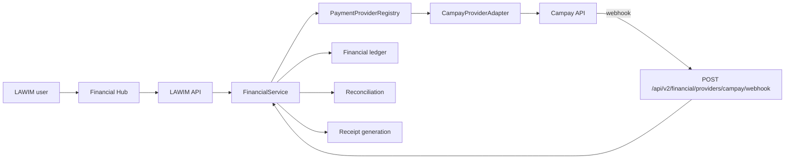

# Campay Integration

## 1. Purpose
Campay is the first concrete payment connector for LAWIM_V2. It is integrated as a provider adapter inside the Financial Core, not as a separate payment application. The backend remains the source of truth for invoices, payment intents, attempts, transactions, receipts, ledger entries, and reconciliation.

## 2. Architecture

### Internal flow
1. A user or administrator creates an invoice or opens an existing payable invoice.
2. The backend creates a `PaymentIntent`.
3. If initiation is requested, the backend creates a `PaymentAttempt` and calls Campay.
4. Campay status is normalized into LAWIM statuses.
5. A confirmed success updates the invoice, records the transaction, creates the receipt, and posts ledger entries.
6. A webhook is validated, deduplicated, matched, and either confirmed or sent to reconciliation.

## 3. Configuration
The connector is controlled by `AppConfig` and environment variables:

| Variable | Meaning |
| --- | --- |
| `LAWIM_CAMPAY_ENABLED` | Enables the connector |
| `LAWIM_CAMPAY_SANDBOX_ENABLED` | Allows sandbox mode |
| `LAWIM_CAMPAY_ENVIRONMENT` | `sandbox` or `production` |
| `LAWIM_CAMPAY_BASE_URL` | Optional override for the API base URL |
| `LAWIM_CAMPAY_APP_USERNAME` | API username |
| `LAWIM_CAMPAY_APP_PASSWORD` | API password |
| `LAWIM_CAMPAY_TOKEN` | Preloaded token, when available |
| `LAWIM_CAMPAY_WEBHOOK_SECRET` | HMAC secret for webhook validation |
| `LAWIM_CAMPAY_WEBHOOK_URL` | Callback endpoint sent to Campay |
| `LAWIM_CAMPAY_REDIRECT_URL` | Redirect target for user return flows |
| `LAWIM_CAMPAY_DEFAULT_CURRENCY` | Default currency, currently `XAF` |
| `LAWIM_CAMPAY_TIMEOUT_SECONDS` | HTTP timeout for provider calls |
| `LAWIM_CAMPAY_MAX_RETRIES` | Retry budget for internal retry logic |
| `LAWIM_CAMPAY_STATUS_CHECK_INTERVAL` | Polling interval for status checks |
| `LAWIM_CAMPAY_PROVIDER_PRIORITY` | Provider registry ordering |

When Campay is enabled, LAWIM validates that:
- the base URL is present
- the webhook URL is present
- the webhook secret is present
- either a token or username/password credentials are present

The current default base URL is derived from the environment:
- sandbox: `https://demo.campay.net`
- production: `https://www.campay.net`

## 4. Authentication
The adapter authenticates against Campay with a cached token:
- `POST /api/token/`
- token reused until expiry
- cached token guarded by a lock to avoid duplicate refreshes
- no token is logged
- no secret is returned to the frontend

If a token is already supplied by configuration, the adapter reuses it without calling the authentication endpoint immediately.

## 5. Initiation
Payment initiation is backend-driven:
1. The user selects a payable invoice.
2. The backend validates invoice status, balance, currency, and permissions.
3. If initiation is requested, a `PaymentAttempt` is created.
4. The adapter calls `POST /api/collect/`.
5. The adapter normalizes the provider response into:
   - `PENDING`
   - `PROCESSING`
   - `REQUIRES_ACTION`
   - `SUCCESSFUL`
   - `FAILED`
   - `CANCELLED`
   - `EXPIRED`

The frontend only submits the invoice identifier and a Mobile Money number. It does not compute the amount.

## 6. Status
Status verification uses:
- `GET /api/transaction/{reference}/`

The backend:
- normalizes Campay status values
- updates the intent and latest attempt
- confirms successful payments only after a verified provider result
- marks failed or expired flows without creating receipts

The current adapter records provider status checks for audit and reconciliation.

## 7. Webhooks
LAWIM exposes:
- `POST /api/v2/financial/providers/campay/webhook`

Webhook processing:
1. reads the raw request body
2. validates the payload size and JSON content at the server layer
3. validates the signature using the raw payload
4. records a `ProviderEvent`
5. deduplicates repeated provider event identifiers
6. matches the event to an existing `PaymentAttempt`
7. resolves the parent `PaymentIntent`
8. confirms or rejects the payment
9. creates a reconciliation record for orphan or mismatched events

Accepted signature headers:
- `X-LAWIM-WEBHOOK-SIGNATURE`
- `X-Campay-Signature`
- `X-Signature`

The validation accepts:
- raw hex HMAC signatures
- `sha256=...`
- `hmac-sha256=...`
- base64 signatures when the provider uses that format

## 8. Security
Security controls currently implemented:
- backend permission checks
- raw webhook signature validation
- provider event deduplication
- payload redaction for sensitive headers
- audit events on state transitions
- no frontend-side payment confirmation

Sensitive data excluded from logs and responses:
- Campay tokens
- Campay webhook secrets
- Mobile Money PINs
- raw authorization headers

## 9. Idempotence
Idempotence is enforced at several levels:
- payment intent record keys
- payment attempt record keys
- provider event record keys
- webhook event deduplication
- receipt generation checks
- refund request limits

The current implementation ensures that a duplicate webhook or a repeated payment status check does not create a second final financial effect.

## 10. Retries and Recovery
The connector supports recovery without creating duplicate debits:
- cached token refresh
- repeated status checks
- repeated webhook delivery
- repeated frontend refreshes

The current implementation does not yet expose a full circuit breaker. Instead, it relies on provider health checks, status normalization, and deduplicated event handling.

## 11. Refunds and Cancellation
Campay refund and cancel operations are represented, but the current documented provider flow does not expose a safe automatic refund path in this delivery.

Current behavior:
- `cancel_payment()` returns `UNSUPPORTED`
- `refund_payment()` returns `UNSUPPORTED`
- LAWIM keeps the internal refund workflow through `request_refund()`, `approve_refund()`, and `process_refund()`

This keeps the Financial Core usable even when provider-side refund automation is unavailable.

## 12. Reconciliation
Reconciliation records are created when:
- a webhook cannot be matched to a payment intent
- the amount differs from the internal expectation
- the currency differs from the internal expectation
- provider status is inconsistent or unavailable

This is the primary protection against orphaned or incoherent provider events.

## 13. Health Check
The connector health check uses:
- configuration presence
- token presence or credential presence
- `/api/balance/`

The health snapshot includes:
- environment
- base URL
- support flags
- availability
- balance details when returned

## 14. Metrics
The adapter increments the existing observability counters:
- `campay_auth_success_total`
- `campay_auth_failure_total`
- `campay_request_total`
- `campay_request_duration_seconds`
- `campay_payment_initiated_total`
- `campay_payment_success_total`
- `campay_payment_failure_total`
- `campay_webhook_received_total`
- `campay_webhook_rejected_total`
- `campay_webhook_duplicate_total`
- `campay_status_check_total`
- `campay_status_conflict_total`
- `campay_refund_total`
- `campay_provider_health`

## 15. Alerts
Recommended alert sources:
- provider health degraded
- authentication failures
- webhook rejection spikes
- duplicate webhook spikes
- status conflict spikes
- payment failure spikes
- missing Campay configuration

## 16. Sandbox and Production
Sandbox and production are separated by configuration:
- sandbox defaults to `https://demo.campay.net`
- production defaults to `https://www.campay.net`
- environment is recorded in the provider health snapshot

Validation notes:
- the adapter and unit tests cover the integration logic
- live sandbox or production credentials were not required for the code delivery itself
- when live credentials are available, the connector can be exercised without changing the Financial Core design

## 17. Secret Rotation
Secret rotation is supported operationally by replacing:
- token
- username/password
- webhook secret

The adapter reads secrets from configuration at runtime and does not persist them in the database.

## 18. Troubleshooting
Common failure modes:
- missing Campay enable flag
- missing webhook secret
- missing token or credentials
- invalid webhook signature
- provider timeout
- provider unavailable
- amount mismatch
- currency mismatch
- orphan webhook event

Recommended action:
1. check provider health
2. verify configuration
3. retry status query
4. inspect reconciliation records
5. confirm the invoice and payment intent mapping

## 19. Limitations
Current limitations are explicit:
- automatic Campay refunds are not enabled in this delivery
- automatic Campay cancellations are not enabled in this delivery
- the connector does not act as a second source of truth
- live sandbox/prod verification depends on external credentials

## 20. References
Sources consulted for the integration design:
- Campay public website
- Campay SDK repository
- Campay package metadata
- LAWIM_V2 codebase and tests in this repository
